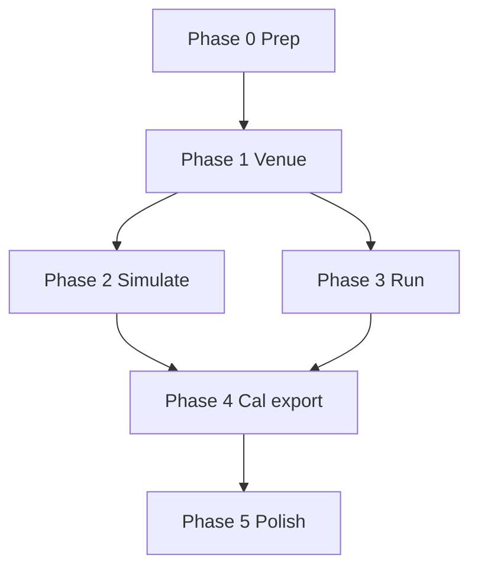

# Spyder Full Configurator & Visualiser — Implementation Plan

> **For agentic workers:** Use `superpowers:subagent-driven-development` or `superpowers:executing-plans`. Work phase-by-phase; commit + push after each phase; open/update PR before claiming done.
>
> **Prerequisite:** Merge `cursor/gui-cable-model-viz-fee8` → `main` first (model-aware cable paths + Design cable picker). Math audit is already on `main` (`872774a`).

**Goal:** Complete the Design → Simulate → Run loop so the SPA is a **full graphical configurator and visualiser** for cable-driven robots — every kinematics/statics/runtime knob the core supports, without CLI.

**Architecture:** Unchanged — `spyder-gui` (Axum :7700) + `web/` (Vite/React/R3F). All math via existing `spyder-*` crates.

**Spec (base):** `docs/superpowers/specs/2026-07-10-spyder-gui-design.md`  
**Current user guide:** `docs/gui.md` (update after each phase)

---

## Baseline inventory (post viz branch)

| Area | Status |
|------|--------|
| Model-aware cable polylines (ideal/pulley/sag) | `spyder-core/cable_path.rs`, `spyder-sim/scene.rs` |
| Scene snapshot API | `cable_paths`, `unit_pulls`, `model` |
| Design cable model picker | ideal / pulley / sag + radius + sag μ/EA |
| Simulate IK readout | lengths, tensions, unstrained; FK check button |
| Pull-direction arrows | Simulate toggle |
| Platform mode UI | **Missing** |
| Per-anchor pulley UI | **Missing** |
| Home pose editor | **Missing** |
| Polygon preset UI | **Missing** |
| Jacobian / feasible panels | API exists; UI **missing** |
| Waypoint editor | **Missing** |
| Real hardware Run | **Mock only** |
| Field calibration | `spyder-runtime/calibration.rs`; GUI **missing** |
| Playwright E2E | **Missing** |

---

## Phase overview

| Phase | Name | Outcome |
|-------|------|---------|
| **0** | Prep | Branch, merge viz PR, CI green |
| **1** | Venue configurator | Platform, attachments, home, presets, per-anchor pulley, TOML |
| **2** | Simulation depth | Scrubber, waypoints, analysis panels, 6-DOF pose |
| **3** | Run & hardware | Stepper/ODrive/multiboard connect, feedback in 3D |
| **4** | Calibration & export | Field-cal flow, motor mapping, Plotly export |
| **5** | Polish & E2E | Status bar, docs, Playwright, optional Tauri notes |



---

## Phase 0 — Prep

### Task 0.1: Merge and branch

- [ ] Merge `cursor/gui-cable-model-viz-fee8` → `main` (if not already)
- [ ] `git checkout main && git pull`
- [ ] `git checkout -b cursor/full-configurator-fee8`
- [ ] Verify: `cargo test -p spyder-core -p spyder-cables -p spyder-sim`
- [ ] Verify: `cd web && npm ci && npm test && npm run build`
- [ ] Note: `spyder-gui` needs `libudev-dev` on Linux for serial backends

### Task 0.2: Shared frontend state

**Files:** `web/src/context.tsx`, `web/src/hooks/useSceneSnapshot.ts` (new)

- [ ] Extend `Venue` type with all `VenueDto` fields (`pulley_radius`, `sag_mu`, `sag_ea`, `attachments`)
- [ ] Add `scene: SceneData | null`, `refreshScene(dolly)`, `sceneLoading` to context
- [ ] Single debounced `sceneSnapshot` caller (50–100 ms) used by Design + Simulate + Run
- [ ] Commit: `refactor(web): shared scene snapshot hook`

**Acceptance:** Switching tabs does not reset venue; scene refetches on dolly change once.

---

## Phase 1 — Venue configurator (Design tab)

### Task 1.1: Rich anchor DTO

**Files:** `crates/spyder-gui/src/dto.rs`, `design.rs`, `state.rs`, `web/src/api/client.ts`

Replace flat `Vec3Dto` anchors with:

```rust
pub struct AnchorDto {
    pub exit: Vec3Dto,
    #[serde(default)]
    pub pulley_axis: Option<Vec3Dto>,
    #[serde(default)]
    pub pulley_radius: f64,
    #[serde(default)]
    pub pulley_winch_exit: Option<Vec3Dto>,
    #[serde(default)]
    pub pulley_runout_m: f64,
}
```

- [ ] `VenueDto.anchors: Vec<AnchorDto>`
- [ ] `SetAnchorsRequest.anchors: Vec<AnchorDto>`
- [ ] Map to/from `spyder_core::Anchor` in `design.rs`
- [ ] Backward compat: accept legacy `{x,y,z}` anchors in JSON (deserialize untagged or custom)

**Tests:** `spyder-gui` round-trip anchor with pulley fields.

### Task 1.2: Platform vs point-mass

**Files:** `DesignPage.tsx`, `RobotScene.tsx`, `design.rs`

- [ ] Checkbox **Point mass** (when true: attachments forced to origin; disable attachment editor)
- [ ] When false: show **Attachments** section — per-cable body-frame XYZ
- [ ] `set_anchors` sends `attachments` + `point_mass`
- [ ] Scene: cables terminate at `attachments[i]`, not dolly center (already supported in `RobotScene` if `attachments` passed)

**Acceptance:** TOML with `[[attachments]]` loads; cables attach at offset points; classify may change vs point-mass.

### Task 1.3: Layout presets

**Files:** `DesignPage.tsx`

- [ ] **Rect preset** — existing; add dimension fields (width, depth, height)
- [ ] **Polygon preset** — `n`, `radius`, `height` → `POST /venue/from_preset { kind: "polygon", ... }`
- [ ] Preset dialog includes `point_mass` checkbox

### Task 1.4: Home pose

**Files:** `dto.rs`, `design.rs`, `api.rs`, `DesignPage.tsx`

New route:

```
POST /venue/home
{ "home": [x, y, z] }
→ VenueResponse
```

- [ ] Update `AppState.home` on set
- [ ] Design inspector: home XYZ fields
- [ ] Button **Set home from dolly** (uses current Simulate/Design dolly)
- [ ] TOML emit/parse `[home]` — already partial in `toml_venue.rs`; verify round-trip

### Task 1.5: Per-anchor pulley inspector

**Files:** `DesignPage.tsx` (expand anchor cards)

When `venue.model === "pulley"`:

- [ ] Per-anchor: radius override (0 = use default)
- [ ] Pulley axis: presets `Z-up` / `X` / `Y` or custom XYZ
- [ ] Advanced (collapsible): winch exit vector, runout (m)
- [ ] Changing winch exit updates scene `cable_paths` visibly

### Task 1.6: Venue TOML canonical format

**Files:** `toml_venue.rs`, `spyder-runtime/src/calibration.rs`

Canonical TOML sections:

```toml
preset = "rect"          # or explicit [[anchors]]
width = 10.0
depth = 6.0
height = 8.0
point_mass = true
cable_model = "pulley"
pulley_radius = 0.06
sag_mu = 1.0
sag_ea = 1000000.0

[[anchors]]
x = 5.0
y = 3.0
z = 8.0
pulley_radius = 0.08      # optional per-anchor

[[attachments]]
x = 0.1
y = 0.0
z = 0.0

[home]
x = 0.0
y = 0.0
z = 2.0
```

- [ ] Parse all fields
- [ ] Emit all fields on save
- [ ] Tests: ideal / pulley / sag / platform round-trips

**Phase 1 acceptance:**

1. Configure rect or polygon, point-mass or platform, ideal/pulley/sag, per-anchor pulley, home — all via UI
2. Save TOML, reload, scene identical
3. `cargo test -p spyder-gui` passes (install `libudev-dev` if needed)

**Commit message:** `feat(gui): complete venue configurator (platform, attachments, home, pulley)`

---

## Phase 2 — Simulation depth (Simulate tab)

### Task 2.1: Pose scrubber

**Files:** `SimulatePage.tsx`, `RobotScene.tsx`

- [ ] XYZ sliders or draggable dolly (TransformControls on platform mesh)
- [ ] Debounced scene + IK refresh on scrub
- [ ] Display current dolly in status readout

### Task 2.2: Waypoint editor

**Files:** `dto.rs`, `sim_svc.rs`, `api.rs`, `SimulatePage.tsx`

New route:

```
POST /traj/waypoints
{ "waypoints": [[x,y,z], ...] }
→ { "waypoints": [...], "lengths": [[...], ...] }
```

- [ ] Editable waypoint table (add/remove/reorder rows)
- [ ] Import/export JSON clipboard
- [ ] Play animates full list (not only line segment)
- [ ] Keep existing `/traj/line` for quick line plans

### Task 2.3: Analysis inspector panels

Collapsible sections in Simulate sidebar:

| Panel | Route | UI |
|-------|-------|-----|
| IK | `POST /ik` | lengths, tensions, unstrained |
| FK | `POST /fk` | xyz, residual, method |
| Jacobian | `POST /jacobian` | m×3 table (platform: extend API to 6 cols later) |
| Feasible | `POST /feasible` | ok + mg/f_min/f_max inputs |
| Classify | from venue | IRPM/CRPM/RRPM badge |

- [ ] Wire `api/client.ts` for `fk`, `jacobian`, `feasible` (fk/jacobian exist; ensure exported)
- [ ] Auto-refresh panels when dolly changes (debounced)

### Task 2.4: Platform 6-DOF pose

**Files:** `dto.rs`, `sim_svc.rs`, `fk.rs` integration, `SimulatePage.tsx`, `RobotScene.tsx`

Extend:

```
POST /scene/snapshot
{ "xyz": [x,y,z], "orientation_rv": [rx,ry,rz] }  # optional

POST /fk
{ "lengths": [...], "seed": [x,y,z], "orientation_rv": [...], "tensions": [...], "allow_underconstrained": false }
```

- [ ] Build `Pose` from position + `UnitQuat::from_scaled_axis`
- [ ] Orientation sliders (rx, ry, rz) when `!point_mass`
- [ ] Optional: `TransformControls` rotation gizmo on platform
- [ ] FK uses `robot.fk_with_options` for sag (`tensions` from last IK)

### Task 2.5: Workspace configuration

**Files:** `SimulatePage.tsx`

- [ ] Expose min/max/nx/ny/nz/mg/f_min/f_max (defaults sensible for current venue size)
- [ ] Loading state during sample
- [ ] Clear workspace button

**Phase 2 acceptance:**

1. Scrub pose → cables, IK, Jacobian, feasible update live
2. Edit waypoint list → play animation through all points
3. Platform mode: orientation affects cable paths and FK
4. Sag model: unstrained lengths + catenary visible

**Commit:** `feat(gui): simulate analysis panels, waypoints, 6-DOF scrub`

---

## Phase 3 — Run & hardware (Run tab)

### Task 3.1: Enable real backends

**Files:** `run_svc.rs`, `api.rs`, `RunPage.tsx`

Remove hard reject in `api.rs` for non-mock backends.

Implement `RunSession::connect`:

| Backend | Runtime type | Connect params |
|---------|--------------|----------------|
| `mock` | `MockBackend` | existing |
| `stepper` | `StepperBackend` + `SerialTransport` or `TcpTransport` | `device`, `baud` |
| `odrive` | `ODriveBackend` | `device`, baud, axis config |
| `multiboard` | `MultiBoardBackend` | `axis_map` JSON |

- [ ] `ConnectRequest` validation per backend
- [ ] Store connected backend in `RunSession` enum (not mock-only struct)
- [ ] Disconnect cleans up transport

**Tests:** Mock unchanged; stepper against `spyder-stepper-sim` TCP if available in CI (optional feature flag).

### Task 3.2: Run UI form

**Files:** `RunPage.tsx`

- [ ] Backend `<select>`: mock, stepper, odrive, multiboard
- [ ] Device path / host:port field
- [ ] Baud rate (stepper/odrive)
- [ ] Axis map JSON textarea (multiboard)
- [ ] Connect / Disconnect buttons; Play disabled until connected
- [ ] Safety copy: “Explicit connect required”

### Task 3.3: Playback integration

- [ ] Reuse Simulate waypoint plan OR inline start/end/segments
- [ ] `closed_loop`, `realtime` checkboxes → `PlayLineRequest`
- [ ] Show `final_steps`, `feedback_pose` in readout

### Task 3.4: Live 3D feedback

**Files:** `RunPage.tsx`, `context.tsx`

- [ ] Poll `GET /run/status` every 200–500 ms while connected
- [ ] Update dolly from `pose` when present
- [ ] Status bar: steps[], estopped, backend name
- [ ] E-stop pulse styling (CSS animation per design spec §7)

### Task 3.5: Safety limits display

**Files:** `run_svc.rs`, `dto.rs`, `RunPage.tsx`

- [ ] Expose `SafetyLimits` summary in `RunStatusResponse` (max length delta, workspace box if configured)
- [ ] Show in Run inspector

**Phase 3 acceptance:**

1. Mock run: connect → play line → steps nonzero → estop blocks play → clear estop
2. Stepper sim: connect to TCP stepper sim → play short line
3. 3D dolly follows feedback pose when available

**Commit:** `feat(gui): hardware run backends and live feedback`

---

## Phase 4 — Calibration & export

### Task 4.1: Calibration API

**Files:** `cal_svc.rs` (new), `dto.rs`, `api.rs`

```
GET  /calibration           → current Calibration snapshot or defaults
POST /calibration/capture   → { home?, drum_radius_m, steps_per_rev } uses Calibration::capture
POST /calibration/anchor    → { index, exit: [x,y,z] } override one anchor
POST /calibration/apply     → apply anchors + home to AppState.robot
GET  /calibration/json      → download JSON
POST /calibration/load      → { json: string }
```

Reuse `spyder_runtime::calibration::{Calibration, apply_anchor_override}`.

### Task 4.2: Calibration UI (Design tab section)

- [ ] Drum radius, steps/rev fields
- [ ] **Capture calibration** button (home = current home pose)
- [ ] Per-anchor **Measure** — set anchor exit from numeric entry or “use current tool position” (manual XYZ for now)
- [ ] Export calibration JSON + merged venue TOML

### Task 4.3: Motor mapping (advanced)

**Files:** `dto.rs`, `sim_svc.rs`, Design advanced panel

- [ ] Per-cable: drum radius, steps/rev (build `spyder_runtime::Axis` list)
- [ ] Store in `AppState` or venue extension
- [ ] IK with `reference_lengths` + winches/motors → show `motor_commands` in Simulate IK panel

### Task 4.4: Scene export

```
POST /scene/export
{ "xyz": [x,y,z], "format": "html" | "html_anim", "waypoints": [...]? }
→ { "html": "..." }  or file download Content-Disposition
```

- [ ] Wrap `spyder_sim::write_scene_html` / `write_scene_animation_html`
- [ ] Simulate button **Export Plotly scene**

**Phase 4 acceptance:**

1. Capture calibration at home → export JSON → reload → lengths at home match
2. Download static Plotly HTML of current pose with pulley polylines

**Commit:** `feat(gui): field calibration and scene export`

---

## Phase 5 — Polish, docs, E2E

### Task 5.1: App chrome

**Files:** `App.tsx`, `styles.css`

- [ ] Bottom **status bar**: model, classify, backend, estop, last FK residual
- [ ] Tab transitions (subtle camera ease — optional)
- [ ] Update `docs/gui.md` MVP table (remove stale “cable model not wired”)

### Task 5.2: API consolidation

```
GET /venue   → VenueResponse (single fetch on app load)
```

- [ ] Reduce duplicate round-trips on startup

### Task 5.3: Playwright E2E

**Files:** `web/e2e/`, `.github/workflows/ci.yml`

Scenarios:

1. Load app → rect preset → 4 anchors visible
2. Switch cable model to pulley → cable path vertex count > 2
3. Simulate → plan line → play (dolly moves)
4. Run mock → connect → estop

- [ ] Headless WebGL flags for CI
- [ ] `npm run e2e` script

### Task 5.4: User guide

**Files:** `docs/gui-configurator.md` (new)

- [ ] Screenshots or ASCII workflows for Design / Simulate / Run
- [ ] TOML reference for all fields
- [ ] Hardware connect examples (stepper TCP, mock)

### Task 5.5: Optional Tauri (document only)

- [ ] Add `docs/gui-tauri.md` stub: embed `web/dist` + spawn Axum on localhost — not blocking

**Phase 5 acceptance:**

- [ ] CI: `cargo test -p spyder-gui`, `npm test`, `npm run build`, `npm run e2e`
- [ ] README links to full configurator guide

**Commit:** `docs(gui): full configurator guide and E2E tests`

---

## Complete API surface (target)

| Method | Path | Notes |
|--------|------|-------|
| GET | `/health` | exists |
| GET | `/venue` | **new** — venue + classify |
| POST | `/venue/load` | exists |
| POST | `/venue/from_preset` | exists |
| POST | `/venue/set_anchors` | extend AnchorDto |
| POST | `/venue/set_model` | exists (viz branch) |
| POST | `/venue/home` | **new** |
| GET | `/venue/toml` | exists |
| POST | `/ik` | + unstrained_lengths |
| POST | `/fk` | + orientation_rv, tensions, FkOptions |
| POST | `/jacobian` | extend 6-DOF rows when platform |
| POST | `/feasible` | exists |
| POST | `/workspace` | exists |
| POST | `/traj/line` | exists |
| POST | `/traj/waypoints` | **new** |
| POST | `/scene/snapshot` | + orientation_rv |
| POST | `/scene/export` | **new** |
| GET/POST | `/calibration/*` | **new** |
| POST | `/run/connect` | all backends |
| POST | `/run/*` | exists |

---

## File touch map (all phases)

```
crates/spyder-gui/src/
  dto.rs           # AnchorDto, extended FK/traj/cal DTOs
  design.rs        # home, rich anchors, attachments
  cal_svc.rs       # NEW — calibration wrappers
  sim_svc.rs       # waypoints, fk options, scene export
  run_svc.rs       # stepper/odrive/multiboard sessions
  api.rs           # all routes
  state.rs         # motor axes, calibration state
  toml_venue.rs    # full TOML

crates/spyder-core/src/
  (minimal — only if FK/jacobian helpers needed)

web/src/
  context.tsx
  hooks/useSceneSnapshot.ts   # NEW
  api/client.ts
  pages/DesignPage.tsx
  pages/SimulatePage.tsx
  pages/RunPage.tsx
  scene/RobotScene.tsx
  components/AnalysisPanel.tsx  # NEW (optional)
  components/WaypointEditor.tsx # NEW (optional)
  e2e/*.spec.ts                 # NEW

docs/
  gui.md                        # update
  gui-configurator.md           # NEW
```

---

## Definition of done (entire plan)

- [ ] **Configure** rect/polygon venue, point-mass/platform, ideal/pulley/sag, per-anchor pulley, home, attachments — UI + TOML
- [ ] **Visualise** model-correct cables, pulls, workspace, trajectories, platform orientation
- [ ] **Analyse** IK/FK/Jacobian/feasible/classify at any pose
- [ ] **Run** mock + at least one real backend (stepper TCP) with e-stop and 3D feedback
- [ ] **Calibrate** capture/export/apply without CLI
- [ ] **Test** Rust API tests + web unit + Playwright E2E green in CI
- [ ] **Document** updated `docs/gui.md` + `docs/gui-configurator.md`

---

## Risk register

| Risk | Mitigation |
|------|------------|
| `libudev` breaks CI | Document apt dep; optional `serial` feature flag on spyder-gui |
| WebGL flaky in Playwright | software GL flags; assert DOM + API not pixels |
| TOML breaking changes | Legacy parser for flat anchors; version field in TOML |
| API spam on scrub | Debounce 50–100 ms; cancel in-flight fetch |
| 6-DOF FK underconstrained | Expose `allow_underconstrained` only in advanced FK panel |

---

## Suggested commit / PR sequence

1. `refactor(web): shared scene state` (Phase 0)
2. `feat(gui): venue configurator` (Phase 1) — **draft PR**
3. `feat(gui): simulate depth` (Phase 2) — update PR
4. `feat(gui): hardware run` (Phase 3) — update PR
5. `feat(gui): calibration and export` (Phase 4) — update PR
6. `test(gui): e2e and docs` (Phase 5) — mark PR ready

Branch: `cursor/full-configurator-fee8`  
Base: `main` (with viz branch merged)
